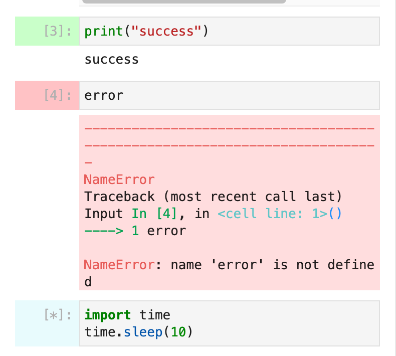
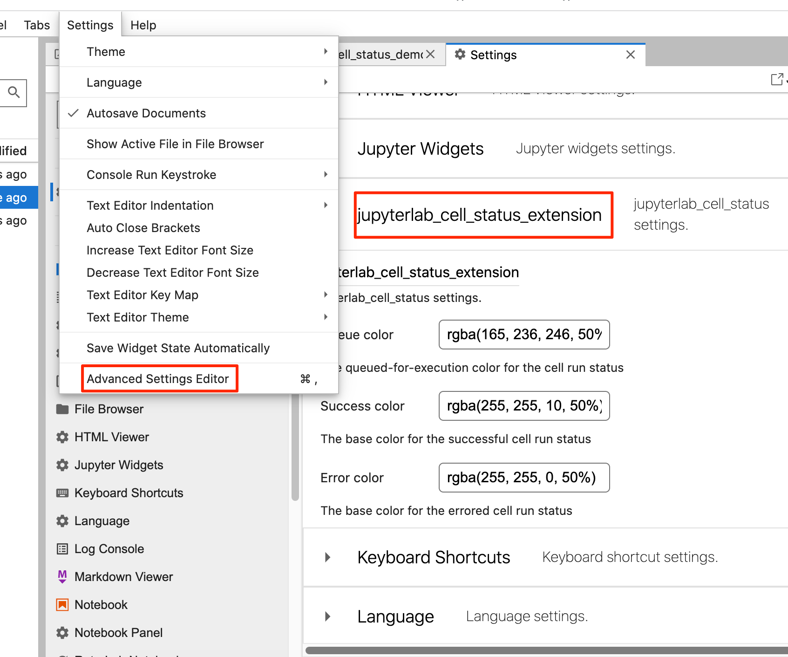

# jupyterlab_cell_status_extension
JupyterLab extension to indicate current cell status

[RetroLite demo](https://innovationoutside.github.io/jupyterlab_cell_status_extension/retro/notebooks/?path=jupyterlab_cell_status_demo.ipynb)

[JupyterLite (JupyterLab) demo](https://innovationoutside.github.io/jupyterlab_cell_status_extension/lab?path=jupyterlab_cell_status_demo.ipynb)

To install the prebuilt extension from a wheel:

`pip3 install --upgrade https://raw.githubusercontent.com/innovationOUtside/jupyterlab_cell_status_extension/main/dist/jupyterlab_cell_status_extension-0.1.3-py3-none-any.whl`

You can update the colour settings in JupyterLab from the *Settings > Advanced Setting* editor. For the change to take effect, close the notebook in JupyterLab and then open it again.

